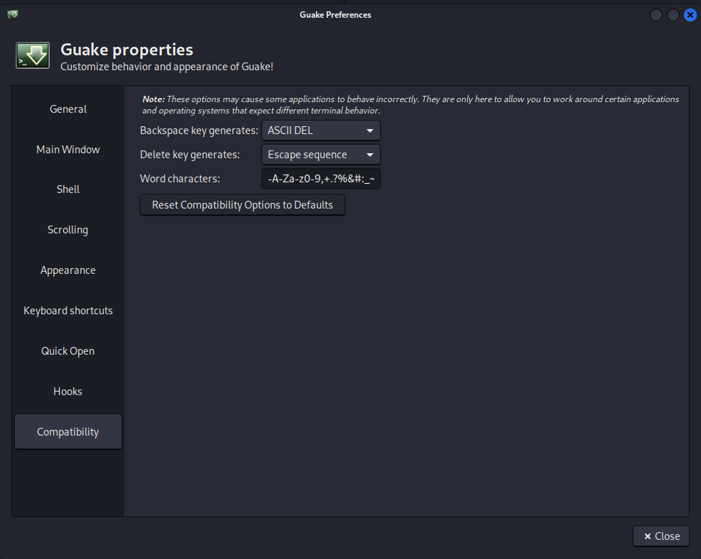
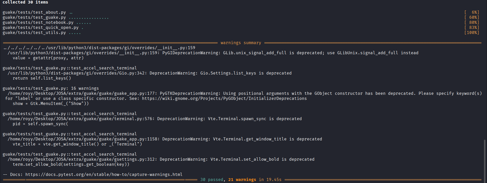

# Pull Request Contribution 1

## Repository

`Guake/guake`

**Issue:** https://github.com/Guake/guake/issues/2304

**Pull Request:** https://github.com/Guake/guake/pull/2332

## Goal 

Add a new Preferences field for configuring the `word-chars` setting from the Preferences window.

## What I changed 

The implementation adds support for editing the `word-chars` setting from the **Preferences → Compatibility** section.

The following files were updated:

- `guake/data/prefs.glade`
- `guake/prefs.py`
- `releasenotes/notes/word-chars-preference-9fc892802ca01441.yaml`

## Implementation

1. Added a new `word_chars_entry` widget to the Preferences window.
2. Loaded the current `word-chars` setting when opening Preferences.
3. Saved changes whenever the entry value is modified.
4. Restored the default `word-chars` value when resetting the Compatibility preferences.
5. Added a Reno release note for the new feature. 

## Validation 

- Ran `make style`.
- Ran `make check`.
- Ran `make test` (30 tests passed).
- Verified that changing the field updates the `word-chars` setting.
- Verified that resetting the Compatibility preferences restores the default `word-chars` value.

## Screenshots

### Before

### After

### Test results

