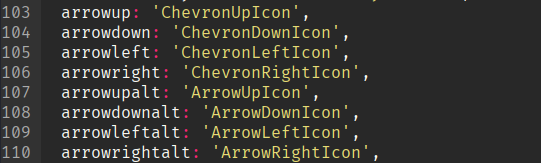
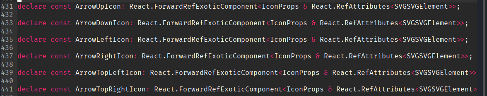
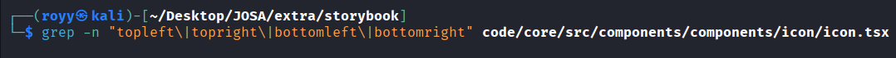
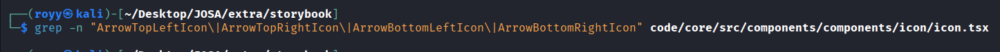

# Triage Contribution 1

## Repository 

`storybookjs/storybook`

**Issue link:** https://github.com/storybookjs/storybook/issues/35378

## Goal 

Verify whether the reported icon mapping issue is still present in the current implementation. 

## What I checked

The verification focused on the current icon mapping implementation.

- `code/core/src/components/components/icon/icon.tsx`
- `@storybook/icons`

## Verification steps

1. Verified the current `arrow*` mappings.
2. Verified the `arrow*alt` mappings.
3. Verified that the diagonal arrow icons are exported.
4. Verified whether `icon.tsx` exposes aliases for the diagonal icons.

## Findings

- `arrowup`, `arrowdown`, `arrowleft`, and `arrowright` map to chevron icons.
- The corresponding arrow icons are exposed through the `arrow*alt` aliases.
- `@storybook/icons` exports diagonal arrow icons.
- `icon.tsx` does not expose aliases for the diagonal arrow icons.

Changing the existing directional aliases may affect existing toolbar visuals. That decision requires maintainer input. 

## Screenshots

### Current icon mapping

The current `arrow*` aliases map to chevron icons, while the corresponding arrow icons are exposed through the `arrow*alt` aliases.

### Exported arrow icons

`@storybook/icons` exports the directional and diagonal arrow icons.

### Missing diagonal aliases

No aliases were found for the diagonal arrow icons in `icon.tsx`.

### Missing diagonal icon names

No references to the exported diagonal arrow icon names were found in `icon.tsx`.

## Outcome
A triage comment was posted with the verification results.

**Comment:** https://github.com/storybookjs/storybook/issues/35378#issuecomment-4910863184
