# Week 1 - Git Internals & Modern Workflow

## Git Archaeology Reflection

Before this, I mainly used Git to push projects to GitHub and collaborate with teammates. I thought Git was simply storing folders and files. After exploring commits, trees, and blobs with `git cat-file`, I understood that Git actually works using objects and pointers connected through hashes, which made its behavior much more logical to me.

---

## Walking Through Git Objects

### Commit Object

```bash
git cat-file -p fefaba592
```

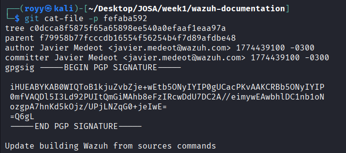

---

### Tree Object

```bash
git cat-file -p c0dcca8f5875f65a65898ee540a0efaaf1eaa97a
```

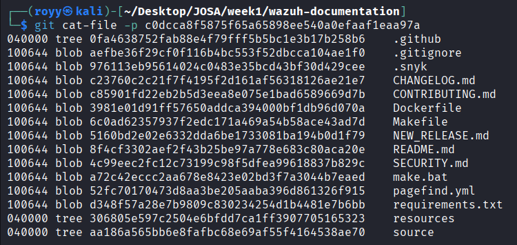

---

### Blob Object

```bash
git cat-file -p 8f4cf3302aef2f43b25be97a778e683c80aca20e
```

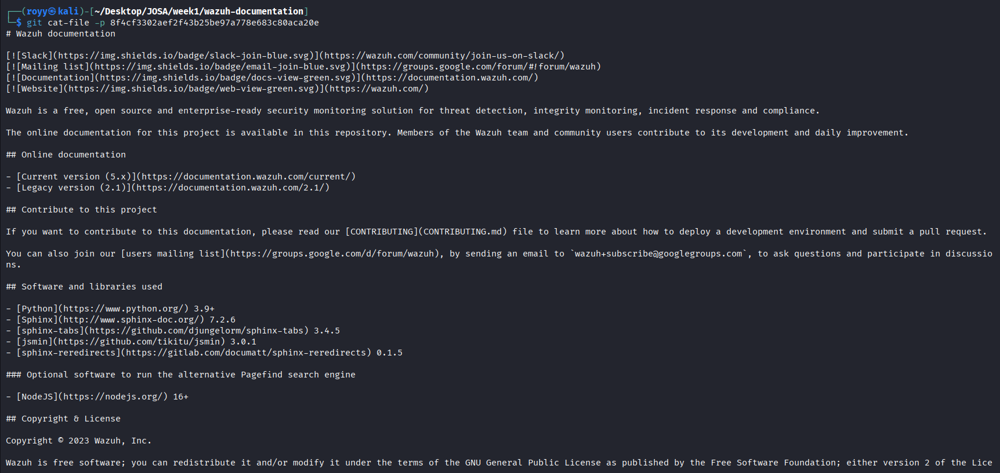

---

## Reflog Rescue Drill
I created multiple commits, then intentionally broke the branch using:

```bash
git checkout -b reflog-practice
```

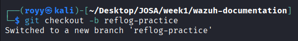


```bash
git log --oneline
```

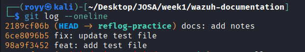


```bash
git reset --hard HEAD~2
```

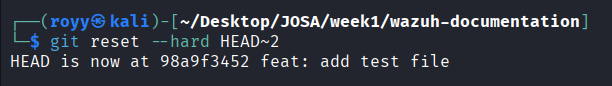


```bash
git reflog
```


```bash
git reset --hard 2189cf06b
git log --oneline
```

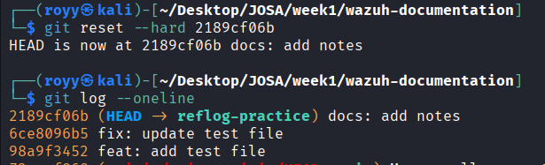

---

## Interactive Rebase

I used interactive rebase to clean the commit history, rename commits using Conventional Commits, and squash unnecessary commits.

### Creating Multiple Test Commits

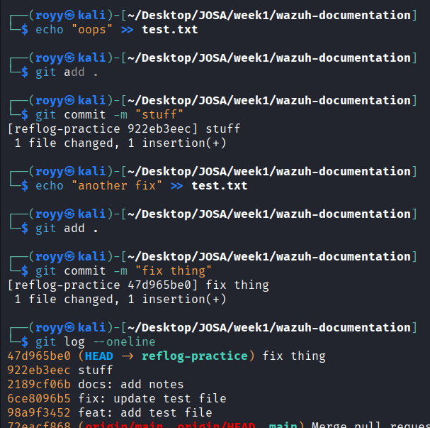

Open the last 5 commits to edit:

```bash
git rebase -i HEAD~5
```

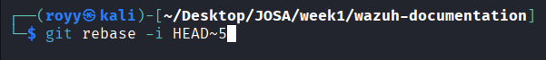

### Editing Rebase Instructions

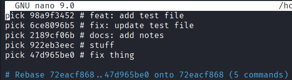

### After Rebase

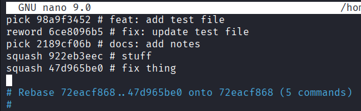

---

## Final Clean Commit History

```bash
git log --oneline
```

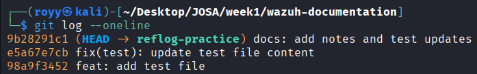
