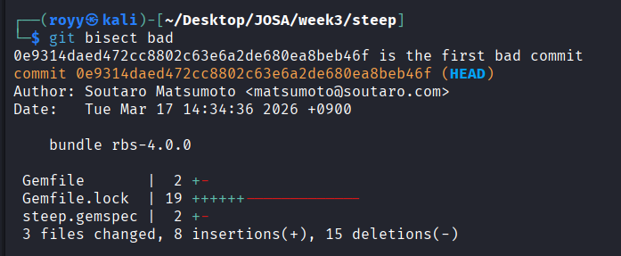

# Week 3 - Issue Triage & Bug Reproduction 

## Task 1 - Reproduce One Issue 

**Issue:** create-t3-app #2178
Issue link: https://github.com/t3-oss/create-t3-app/issues/2178

Comment link: https://github.com/t3-oss/create-t3-app/issues/2178#issuecomment-4640646594

### Environment 

* OS: Kali Linux 
* Node.js: v24.15.0
* pnpm: v10.14.0

### Reproduction Steps

1. `git clone https://github.com/FilipMasar/t3-reproducable-bug`. 
2. Ran `pnpm install`.
3. Ran `pnpm run check:unsafe`.

### Actual Result

`check:unsafe` failed and Biome reported diagnostics inside generated Prisma files under `generated/prisma`, including files such as `generated/prisma/query_engine_bg.js`.

The command exited with code 1 after reporting multiple errors and warnings from generated Prisma output.

### Conclusion 

This matches the reported behavior. Running the Biome check reports diagnostics from files under `generated/prisma` and exits with an error.

### Note

I also noticed that the exact files reported in my environment differ from those shown in the issue report, but the underlying behavior appears to be the same.

---

## Task 2 - Build One MCVE

**Issue:** create-t3-app #2217
Issue link: https://github.com/t3-oss/create-t3-app/issues/2217
 
Comment link: https://github.com/t3-oss/create-t3-app/issues/2217#issuecomment-4640701081

### Environment 

* OS: Kali Linux
* Node.js: v24.15.0 
* pnpm: v10.14.0

### Minimal Reproduction

```bash
git clone https://github.com/brucexu-eth/t3-prisma-issue
cd t3-prisma-issue
pnpm install 
pnpm run format:write
git diff --stat
```
### Expected Result

Generated Prisma files should not create formatting-related diff churn.

### Actual Result 

`git diff --stat` reported changes under `generated/prisma`.

In my run, the output reported:

```text
22 files changed, 72479 insertions(+), 5933 deletions(-)
```

Examples of modified files:

```text
generated/prisma/index.js
generated/prisma/index.d.ts
generated/prisma/query_engine_bg.js
generated/prisma/runtime/library.js
generated/prisma/runtime/edge.js
```

---

## Task 3 - Git Bisect 

**Issue:** Steep #2227

Issue link: https://github.com/soutaro/steep/issues/2227

For this task, I used the Steep repository and investigated issue #2227, where `Hash#key?` incorrectly rejects an `interned` parameter in Steep `v2.0.0`.

The behavior worked correctly in `v1.10.0` and failed in `v2.0.0`.

### Commands Used

```bash
git bisect start
git bisect bad v2.0.0
git bisect good v1.10.0
```
For each commit selected by Git, I installed dependencies and ran the reproduction:

```bash
bundle install 

BUNDLE_GEMFILE=/home/royy/Desktop/JOSA/week3/steep/Gemfile \
bundle exec /home/royy/Desktop/JOSA/week3/steep/exe/steep check
```

When the command reported: 

```text
No type error detected
```

I marked the commit as good: 

```bash
git bisect good 
```

When the command reported

```text
Ruby::ArgumentTypeMismatch
```

I marked the commit as bad: 

```bash
git bisect bad 
```

### Result 

Git identified the first bad commit as: 

```text
0e9314daed472cc8802c63e6a2de680ea8beb46f
bundle rbs-4.0.0
```




Finally, I exited bisect mode: 

```bash
git bisect reset
git status
```

### Reflection

This exercise showed me how efficiently `git bisect` narrows a regression using a binary search approach. Instead of manually checking hundreds of commits, Git was able to identify the exact commit that introduced the behavior change in only a few steps.

---

## Task 4 - Issue Triage 

**Issue:** Storybook #30705

Issue link: https://github.com/storybookjs/storybook/issues/30705

### Issue Triage

I reviewed Storybook issue #30705, which reports that the "Show code" panel displays HTML tags as escaped entities (e.g., `&lt;` and `&gt;`) instead of rendering the source code correctly.

The issue originally affected a Stencil + Storybook setup, but later comments indicated that similar behavior was also observed in React and Angular environments. This suggested that the problem might not be specific to Stencil.

During the triage process, a Storybook contributor requested that affected users retest the issue using Storybook 10.4 because the source-code generation backend had changed significantly. As a result, the issue was labeled `needs reproduction`.

My conclusion was that the issue could not currently be verified on a recent Storybook version without an updated reproduction. The current status is waiting for contributors to provide a new reproduction repository or confirm whether the bug still exists in Storybook 10.4.

This issue was a useful triage example because the discussion focused on verifying the reported behavior, determining whether the problem affected multiple frameworks, and requesting an updated reproduction before further investigation. The issue remains open, but its scope and current status became clearer through the triage process.


