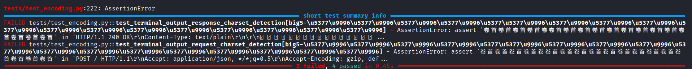
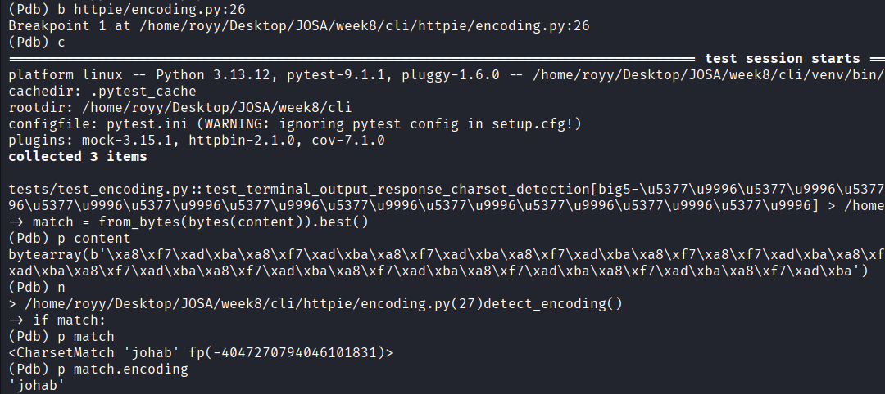
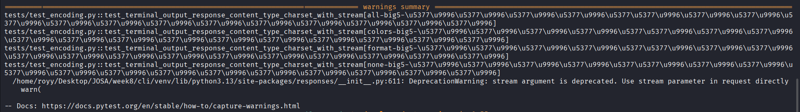
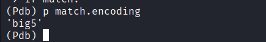

# Week 8 - Performance, Profiling & Debugging

## Task 1 - Profile and fix 

I chose the `pygments/pygments` repository for this task.

I profiled the `WikitextLexer` using the large `article_france.wikitext` example already included in the repository.

To understand where the execution time was spent, I used two profiling approaches:

- `py-spy` to generate a flame graph.
- Pygments' built-in `ProfilingRegexLexer` to determine whether a single regular expression was responsible for most of the runtime. The results showed that the execution time was distributed across many regex rules rather than one obvious bottleneck.

I benchmarked the complete highlighting workflow by repeatedly calling:

```python
highlight(
    text,
    WikitextLexer(),
    TerminalFormatter(),
)
```

The benchmark averaged **955.8 ms** for the complete highlighting workflow on the 338,291-character test file.

The flame graph identified `RegexLexer.get_tokens_unprocessed()` as the dominant application-level hotspot during highlighting.

After reviewing the profiling results, I could not identify a small and obviously safe optimization. Since changing the regex order or matching behavior could affect tokenization correctness, I decided not to prepare a pull request.

Instead, I opened an [Issue](https://github.com/pygments/pygments/issues/3240) in the Pygments repository summarizing my findings, including the benchmark results and the flame graph.

---

## Task 2 - Find an N+1

For this task, I searched for multiple open-source Django projects for N+1 queries. Since not every project necessarily contains one, I investigated several different projects instead of stopping after the first attempt.

**Django Oscar**

I set up the project locally, enabled SQL query logging, and inspected several pages, including the storefront catalog and multiple dashboard pages (Products, Orders, Customers, and Reviews). I also created sample data where necessary to generate realistic SQL queries.

I found that most database relationships already used joins or batched queries, and I could not identify any N+1 queries.

**Healthchecks**

I explored the project structure and inspected several pages that could potentially trigger N+1 queries. However, I did not find any clear case that demonstrated the issue.

**django-cart**

Before writing any additional tests, I reviewed the project's existing test suite. I found dedicated performance and query-count tests that verify constant query counts during iteration and product loading. These regression tests already help prevent common N+1 scenarios, so I did not identify a new case worth reporting.

### Findings

Although I could not find an N+1 query suitable for opening an issue or submitting a fix, I gained valuable experience in analyzing SQL queries, reviewing query behavior, and evaluating how different open-source projects optimize database access.

To be continued.

---

## Task 3 - Read 3 real flame graphs

For this task, I selected the following flame graphs:

### [1. MySQL CPU Flame Graph](https://www.brendangregg.com/FlameGraphs/cpuflamegraphs.html)

**What's hot:**
`JOIN::exec` was the hottest function because it occupied the widest area in the flame graph.

**What's the bottleneck:**
Most of the CPU time was spent executing MySQL joins, making the query execution path the main bottleneck.

**What I learned:**
The flame graph made the real hotspot obvious, while the text-based profile was much harder to interpret.

### [2. Java Flame Graph](https://www.brendangregg.com/blog/2014-06-12/java-flame-graphs.html)

**What's hot:**
The Rhino JavaScript execution path was the hottest part of the profile because it consumed a large share of the CPU samples.

**What's the bottleneck:**
The Rhino execution was the main bottleneck. Other functions, such as writing data back to clients, were also hot but represented normal server work rather than a performance issue.

**What I learned:**
Flame graphs make it much easier to identify CPU-intensive Java code without getting lost in lengthy profiling outputs.

### [3. DOOM GPU Flame Graph](https://www.brendangregg.com/blog/2025-05-01/doom-gpu-flame-graphs.html)

**What's hot:**
Shader compilation and NIR preprocessing were the hottest CPU-side code paths because they consumed most of the sampled CPU time.

**What's the bottleneck:**
The CPU spent a significant amount of time compiling and preparing shaders before the GPU could execute them, making CPU-side shader preparation the main bottleneck.

**What I learned:**
Even in GPU-intensive applications, a flame graph can reveal CPU bottlenecks that delay GPU execution and affect overall performance.

---

## Task 4 - Use a real debugger 

I selected an existing bug from the `httpie/cli` repository, [Issue #1628](https://github.com/httpie/cli/issues/1628).

The issue reported that Big5-encoded Chinese text was no longer decoded correctly after upgrading to `charset-normalizer` 3.x.

### Reproducing the Bug

I first ran the two affected tests:

```bash
python -m pytest -v \
tests/test_encoding.py::test_terminal_output_response_charset_detection \
tests/test_encoding.py::test_terminal_output_request_charset_detection
```



The Big5 test cases failed, while the UTF-8 and Windows-1250 cases passed successfully.

I then ran only the Big5-related tests:

```bash
python -m pytest -v tests/test_encoding.py -k "big5"
```

The result was:

```
2 failed, 10 passed
```

The output showed that the original Traditional Chinese text was decoded into incorrect Korean-looking characters.

### Debugging with `pdb`

The failing tests are defined in: `tests/test_encoding.py`

These tests encode text using Big5, execute HTTPie, and verify that the original text appears in the output.

Since the failure was related to character encoding, I followed the execution into the encoding detection logic inside `httpie/encoding.py`.

I started the failing test under `pdb`:

```bash
python -m pdb -m pytest -v -s \
tests/test_encoding.py::test_terminal_output_response_charset_detection
```

I placed a breakpoint on the line responsible for encoding detection:

```text
(Pdb) b httpie/encoding.py:26
(Pdb) c
```

The breakpoint stopped at:

```python
match = from_bytes(bytes(content)).best()
```

I inspected the `content` variable to confirm that it contained the Big5-encoded bytes generated by the test:

```text
(Pdb) p content
```

I then stepped over the detection call using `n` and inspected the detected encoding:

```text
(Pdb) n
(Pdb) p match.encoding
'johab'
```



This showed that `charset-normalizer 3.x` incorrectly detected the `Big5` data as `johab`, which is a Korean character encoding. `HTTPie` then decoded the bytes using the wrong encoding, causing the test to fail.

### Applying the Proposed Fix

The related PR proposed temporarily pinning `charset-normalizer` to a version below `3.0.0` until the upstream detection regression is resolved.

To reproduce the proposed fix locally, I installed version `2.x`:

```bash
pip install "charset-normalizer>=2.0.0,<3.0.0"
```

I verified the installed version:

```bash
python -c "import charset_normalizer; print(charset_normalizer.__version__)"
```



### Verifying the Fix

I then ran only the Big5-related tests:

```bash
python -m pytest -v tests/test_encoding.py -k "big5"
```

The Big5-related tests passed successfully: `12 passed, 41 deselected`

Finally, I repeated the same debugging session and inspected `match.encoding` again.



Before applying the dependency change, `charset-normalizer` detected the input as `johab`. After installing version `2.x`, it correctly detected the input as `big5`, confirming that the dependency change resolved the issue and allowing all related tests to pass.

### What I Learned

The failing tests showed the problem, but `pdb` helped me understand what was causing it. By inspecting `match.encoding`, I saw that `charset-normalizer` detected the Big5 input as `johab` instead of `big5`. After installing version `2.x`, the encoding was detected correctly and the tests passed. This exercise showed me that inspecting variables with breakpoints is much more useful than adding temporary print statements when debugging.
