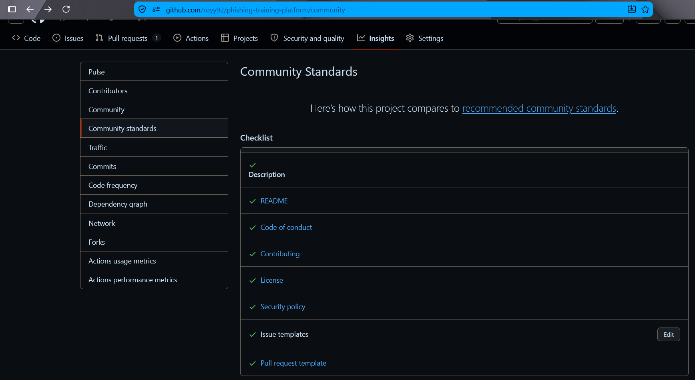

# Week 9 - Building Your Own OSS Project: Licensing & Foundations

## Task 1 - License

For my project, I chose the **MIT License**.

I chose it because the main goal of the project is to make it freely available for as many people as possible to learn about phishing awareness and how to protect themselves from phishing attacks.

The MIT License allows anyone to use, modify, and distribute the project, whether they are individuals, non-profit organizations, private companies, or public institutions.

The license file is available here: [LICENSE](https://github.com/royy92/phishing-training-platform?tab=MIT-1-ov-file). 

---

## Task 2 - Community Profile

I completed all of GitHub's Community Standards requirements for my project.

The repository now includes:

- README
- LICENSE
- CONTRIBUTING
- Code of Conduct
- Security Policy
- Issue templates
- Pull request template

The repository now meets all of GitHub's Community Standards requirements.



---

## Task 3 - CONTRIBUTING.md

I created a comprehensive [CONTRIBUTING.md](https://github.com/royy92/phishing-training-platform/blob/main/CONTRIBUTING.md) guide for contributors.

The guide covers setting up the development environment, running the project locally, running the test suite, reporting bugs, pull request conventions, and code review expectations.

The goal was to make it easy for new contributors to understand the project's workflow before submitting changes.

---

## Task 4 - GOVERNANCE.md

For this task, I adopted the Benevolent Dictator For Life (BDFL) governance model.

The document explains how the project is maintained by a single maintainer, how decisions are made, how pull requests are reviewed, and how community feedback is considered when accepting or declining contributions.

The governance document is available here: [GOVERNANCE.md](https://github.com/royy92/phishing-training-platform/blob/main/GOVERNANCE.md).

---

## Task 5 - Audit OSS Contribution

For this task, I chose **RSS-Bridge**, an open-source project that I was interested in exploring.

Before contributing, I:

- Reviewed the project's Community Profile.
- Read the project's LICENSE.
- Read the CONTRIBUTING guide.

While exploring the repository, I found that the `README.md` contained only a placeholder for `Caddy` installation instructions, which was tracked in [Issue #3785](https://github.com/RSS-Bridge/rss-bridge/issues/3785).

To address the issue, I first installed and configured **RSS-Bridge** locally using `Caddy` and `PHP-FPM`. After verifying that the configuration worked correctly, I documented the installation process by adding a minimal `Caddy` configuration to the `README.md`.

Instead of duplicating the existing Debian installation guide, I reused the existing Debian installation steps and the PHP-FPM pool configuration already documented in the project.

Before opening the Pull Request, I verified that the documented configuration worked correctly and ran the project's automated checks:

```bash
./vendor/bin/phpunit
./vendor/bin/phpcs --standard=phpcs.xml --warning-severity=0 --extensions=php -p ./
```

Finally, I submitted my contribution as Pull Request [#5052](https://github.com/RSS-Bridge/rss-bridge/pull/5052).
